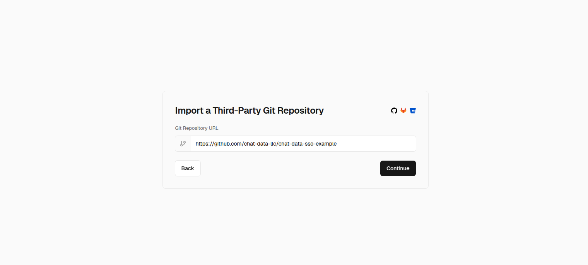
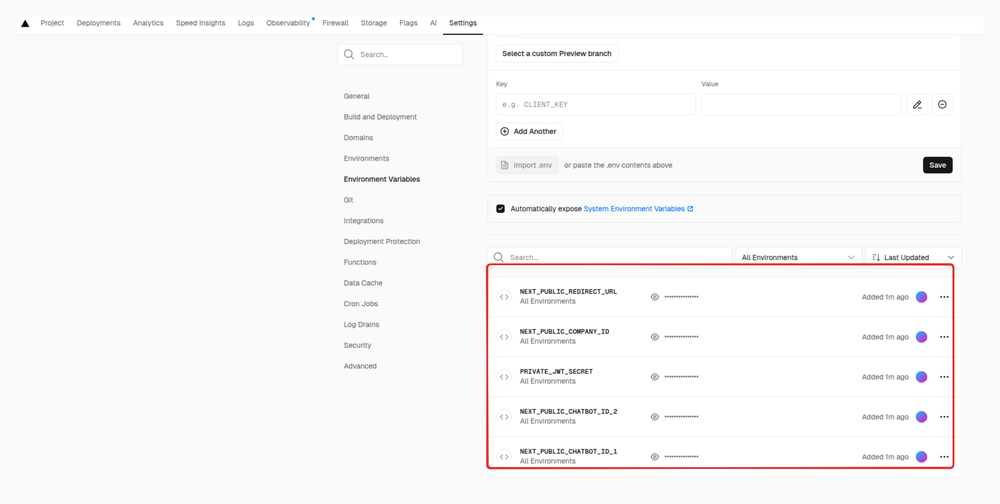

# [Chat Data](https://www.chat-data.com/) SSO Integration with RBAC

## Introduction
SSO redirect enables you to authenticate users through your site before seamlessly routing them back to Chat Data to manage their designated chatbot. This feature is particularly valuable for resellers who want to provide their customers with access to chatbot settings and dashboard functionality without having to build these interfaces from scratch using our API.

This demo now includes a **Role-Based Access Control (RBAC)** system using Firebase Authentication and Firestore, allowing you to manage user permissions and control access to specific chatbots with different permission levels.

## How to use

### 1. Set Up the Environment Variables

- `NEXT_PUBLIC_CHATBOT_ID_1`: The ID of the chatbot 1 that the user has access to.
- `NEXT_PUBLIC_CHATBOT_ID_2`: The ID of the chatbot 2 that the user has access to.
- `NEXT_PUBLIC_COMPANY_ID`: Your company ID, which can be found in the [SSO Login](https://www.chat-data.com/account/sso-login) page.
- `NEXT_PUBLIC_REDIRECT_URL`: The URL of the page you want to redirect to after the user logs out or the chatbot is not found.
- `PRIVATE_JWT_SECRET`: The private secret key for signing the JWT token, which can be found in the [SSO Login](https://www.chat-data.com/account/sso-login) page.

If you're subscribed to the **SSO Login** plan of [Chat Data](https://www.chat-data.com/pricing), you can obtain your `PRIVATE_JWT_SECRET` from the [SSO Login](https://www.chat-data.com/account/sso-login) page.

### 2. Configure DNS Records
Follow the [White Label Your Chatbot](https://cookbook.chat-data.com/docs/white-label-your-chatbot) guide to configure your custom domain for at least one chatbot, enabling it to point to 'https://www.chat-data.com'. Without this configuration, you'll need to use our default 'https://www.chat-data.com' domain for management, which diminishes the benefits of white labeling.

### 2. Vercel deployment

- Click **Import** to import your project:

- Add Environment Variables:

 
- Obtain your deployed page's domain name and open the page.

- Congratulations! Your setup is complete. Upon clicking the chatbot card, users will be seamlessly redirected to a fully white-labeled settings page featuring your company's branding. Users can manage chatbot settings and view conversations through an interface that appears entirely native to your platform, with no visible connection to Chat Data.

## RBAC Features

This demo includes a complete Role-Based Access Control system:

- **User Authentication**: Firebase Auth with email/password and Google sign-in
- **Role Management**: Admin, Editor, and Viewer roles with different permission levels
- **Per-Chatbot Access**: Users can have different roles for different chatbots
- **Admin Dashboard**: User management interface for assigning and revoking access
- **Permission-Based UI**: UI elements are shown/hidden based on user permissions

For detailed RBAC setup instructions, see [RBAC-Setup.md](./RBAC-Setup.md)

## Contact

[Chat Data LLC](admin@chat-data.com)